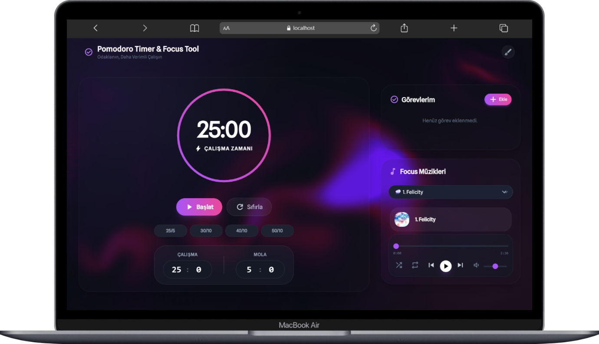

# 🍅 Pomodoro Focus: Odaklanma Aracı

## ✨ Giriş

**Pomodoro Focus**, **Pomodoro Tekniği**'nin yapılandırılmış zaman yönetimini, görsel olarak sakinleştirici bir deneyimle birleştiren minimalist bir web uygulamasıdır. Amacımız, dikkat dağıtıcı unsurları en aza indirerek ve ortamı kişiselleştirerek derin odaklanmayı sağlamaktır.

## 🎯 Pomodoro Focus ile Neler Yapabilirsiniz?

Bu kontrol paneli, üretkenlik döngünüzü yönetmek için ihtiyacınız olan her şeyi tek bir yerde toplar:

| Özellik Alanı | Açıklama | Faydası |
| :--- | :--- | :--- |
| **Pomodoro Zamanlayıcısı** | Özelleştirilebilir odaklanma ve mola süreleri ile yapılandırılmış çalışma döngüsü sağlar. | **Derin Odaklanma:** 25 dakikalık sprintlerle projenize kesintisiz dalmanıza olanak tanır. |
| **Görev Yönetimi** | Çalışma oturumları sırasında akılda tutulması gereken görevleri yönetmenizi sağlar. | **Netlik:** Odaklanma anında görev listeniz her zaman yanınızdadır, zihinsel yükü azaltır. |
| **Ortam Müziği** | Çalışma akışına uygun müzik çalma ve kontrol etme imkanı sunar. | **Akış Durumu (Flow State):** Doğru ses ortamını yaratarak üretkenliğinizi maksimize eder. |
| **Dinamik Temalar** | Uygulamanın ve arkaplanın renklerini ruh halinize göre anında değiştirebilirsiniz. | **Kişiselleştirme:** Görsel konforunuzu artırır ve uzun çalışma saatleri için göz yorgunluğunu azaltır. |

## 🖼️ Proje Görünümleri

Uygulamanın arayüzü ve temel işlevleri hakkında fikir edinmek için aşağıdaki görsellere göz atın.


### 1\. Ana Kontrol Paneli ve Odaklanma Arayüzü

Kontrol panelinin genel düzeni, Timer ve Görev Listesi'nin görünümü.
 [](public/iPhone.png)

-----

*(Görseli buraya yerleştirmek için `public/theme-interaction.png` dosyasını kullanın.)*

## ⚙️ Teknolojiler

  * **React:** Bileşen tabanlı kullanıcı arayüzü.
  * **JavaScript (ESM):** Projenin ana dili.
  * **Tailwind CSS:** Hızlı ve esnek stil oluşturma.
  * **three.js / WebGL:** Akışkan arkaplan simülasyonu için.
  * **React Context API:** Tema ve durum yönetimi için.
  * **Lazy Loading:** `three.js` gibi büyük bağımlılıkların tembel yüklenmesi sayesinde üstün başlangıç performansı.

## 🚀 Kurulum ve Çalıştırma

Bu projeyi yerel makinenizde çalıştırmak için aşağıdaki adımları izleyin.

### Ön Koşullar

  * Node.js (LTS sürümü önerilir)
  * npm veya yarn

### Adımlar

1.  **Depoyu Klonlayın:**
    ```bash
    git clone https://github.com/KULLANICI_ADINIZ/pomodoro-focus-dashboard.git
    cd pomodoro-focus-dashboard
    ```
2.  **Bağımlılıkları Yükleyin:**
    ```bash
    npm install
    # veya
    yarn install
    ```
3.  **Projeyi Başlatın:**
    ```bash
    npm run dev
    # veya
    yarn dev
    ```
    Uygulama yerel sunucunuzda çalışmaya başlayacaktır.

## 📌 Dağıtım (Deployment)

Bu proje, Netlify veya Render gibi modern platformlar için optimize edilmiştir.

| Ayar | Değer (Vite/React) |
| :--- | :--- |
| **Derleme Komutu** | `npm run build` |
| **Yayın Dizini** | `dist` |

## 🤝 Katkıda Bulunma

Geri bildirimleriniz ve katkılarınız değerlidir. Lütfen hata raporları veya özellik önerileri için bir **Issue** açın.

-----

**Pomodoro Focus - Odaklanma Seninle Başlar.**
